# Comprehensive Guide: GNN-Based Item Recommendation

> **A Deep Dive into Graph Neural Networks for Link Prediction**

This guide provides an exhaustive explanation of the GNN implementation for item recommendation, complete with diagrams, code explanations, mathematical intuitions, and architectural variations.

---

## Table of Contents

1. [Overview](#overview)
2. [System Architecture](#system-architecture)
3. [Execution Flow](#execution-flow)
4. [Graph Construction](#graph-construction)
5. [GCN Layer Deep Dive](#gcn-layer-deep-dive)
6. [Adjacency Normalization](#adjacency-normalization)
7. [Model Architecture](#model-architecture)
8. [Training Pipeline](#training-pipeline)
9. [Link Prediction](#link-prediction)
10. [Alternative Approaches](#alternative-approaches)
11. [Complete Code Walkthrough](#complete-code-walkthrough)

---

## Overview

### Problem Statement

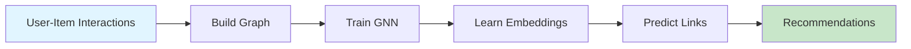

**Input**: User-item interaction data
```
shreya → movie
rk → sports
rk → movie
rp → book
shreya → book
rp → movie
```

**Output**: Recommendation scores for all user-item pairs

**Method**: Link prediction using Graph Neural Networks

---

## System Architecture

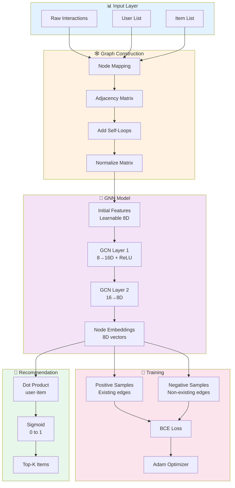

---

## Execution Flow

### Main Pipeline

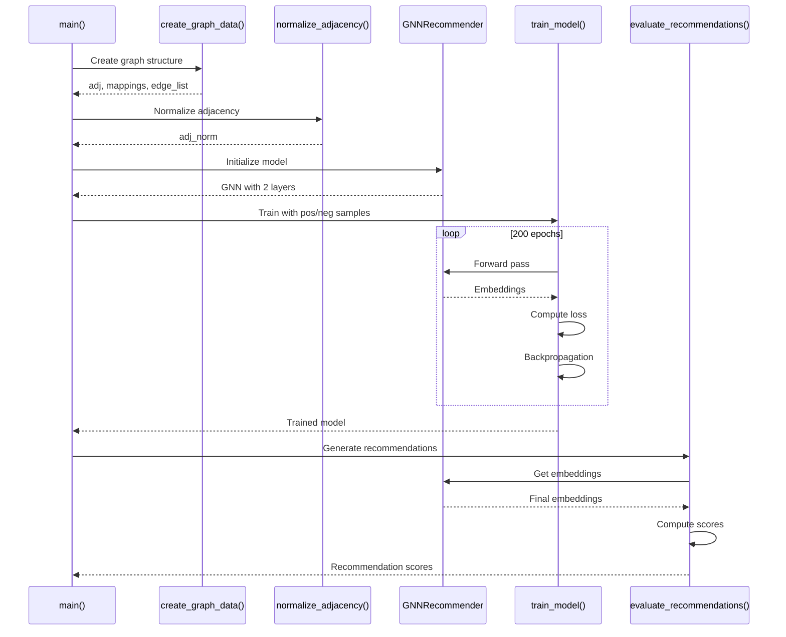

### Data Flow Through GNN Layers

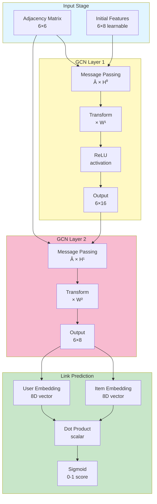

---

## Graph Construction

### Step-by-Step Process

```mermaid
flowchart LR
    subgraph Step1[" 1. Parse Interactions "]
        A1[shreya→movie]
        A2[rk→sports]
        A3[rk→movie]
        A4[rp→book]
        A5[shreya→book]
        A6[rp→movie]
    end

    subgraph Step2[" 2. Extract Entities "]
        B1[Users:<br/>rk, rp, shreya]
        B2[Items:<br/>book, movie, sports]
    end

    subgraph Step3[" 3. Assign IDs "]
        C1[0: rk]
        C2[1: rp]
        C3[2: shreya]
        C4[3: book]
        C5[4: movie]
        C6[5: sports]
    end

    subgraph Step4[" 4. Build Adjacency Matrix "]
        D1[6×6 Matrix]
        D2[Undirected edges]
        D3[Self-loops]
    end
    
    Step1 --> Step2
    Step2 --> Step3
    Step3 --> Step4
    
    style Step1 fill:#e3f2fd
    style Step2 fill:#f3e5f5
    style Step3 fill:#fff9c4
    style Step4 fill:#ffccbc
```

### Code Explanation: Graph Construction

```python
def create_graph_data():
    # 1. Define interactions (edge list representation)
    interactions = [
        ('shreya', 'movie'),
        ('rk', 'sports'),
        # ... more interactions
    ]
    
    # 2. Extract unique entities
    users = sorted(list(set([u for u, _ in interactions])))
    items = sorted(list(set([i for _, i in interactions])))
    # Why sorted? For consistent ordering across runs
    
    # 3. Create bidirectional mappings
    node_to_id = {}  # name → integer ID
    id_to_node = {}  # integer ID → name
    
    # Assign IDs: users first (0,1,2), then items (3,4,5)
    for i, user in enumerate(users):
        node_to_id[user] = i
        id_to_node[i] = user
    
    for i, item in enumerate(items):
        node_to_id[item] = len(users) + i
        id_to_node[len(users) + i] = item
    
    # 4. Build adjacency matrix
    num_nodes = len(users) + len(items)
    adj = torch.zeros(num_nodes, num_nodes)
    
    # Add edges (undirected: both directions)
    for user, item in interactions:
        user_id = node_to_id[user]
        item_id = node_to_id[item]
        adj[user_id, item_id] = 1  # user → item
        adj[item_id, user_id] = 1  # item → user (undirected)
    
    # 5. Add self-loops (critical for GCN!)
    adj = adj + torch.eye(num_nodes)
    
    return adj, id_to_node, user_indices, item_indices, edge_list, node_to_id
```

### Adjacency Matrix Visualization

**Before Self-Loops:**
```
     rk  rp  shreya book movie sports
rk   0   0   0      0    1     1
rp   0   0   0      1    1     0
shreya 0  0   0      1    1     0
book  0   1   1      0    0     0
movie 1   1   1      0    0     0
sports 1  0   0      0    0     0
```

**After Self-Loops:**
```
     rk  rp  shreya book movie sports
rk   1   0   0      0    1     1      ← Self-loop added
rp   0   1   0      1    1     0      ← Self-loop added
shreya 0  0   1      1    1     0      ← Self-loop added
book  0   1   1      1    0     0      ← Self-loop added
movie 1   1   1      0    1     0      ← Self-loop added
sports 1  0   0      0    0     1      ← Self-loop added
```

**Why Self-Loops?**
- Without self-loops: Node only aggregates neighbor information (loses its own features)
- With self-loops: Node retains its own information while aggregating neighbors
- Formula becomes: $H' = \sigma(\hat{A}HW)$ where $\hat{A}$ includes identity matrix

---

## GCN Layer Deep Dive

### Mathematical Foundation

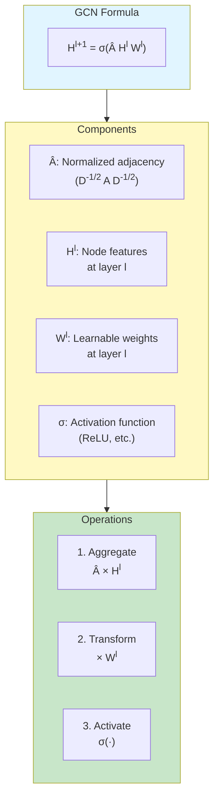

### Code Explanation: GCN Layer

```python
class SimpleGCNLayer(nn.Module):
    def __init__(self, in_features: int, out_features: int):
        super(SimpleGCNLayer, self).__init__()
        # Learnable weight matrix: [in_features, out_features]
        # Initialized with small random values (×0.01 for stability)
        self.weight = nn.Parameter(torch.randn(in_features, out_features) * 0.01)
        
    def forward(self, x: torch.Tensor, adj_norm: torch.Tensor) -> torch.Tensor:
        """
        x: [num_nodes, in_features]
        adj_norm: [num_nodes, num_nodes] (normalized adjacency)
        
        Returns: [num_nodes, out_features]
        """
        # Step 1: Message Passing (Aggregation)
        # Each node aggregates features from its neighbors
        # aggregated[i] = Σⱼ adj_norm[i,j] * x[j]
        aggregated = torch.matmul(adj_norm, x)  # [N, in_features]
        
        # Step 2: Feature Transformation
        # Apply learnable transformation to aggregated features
        output = torch.matmul(aggregated, self.weight)  # [N, out_features]
        
        return output
        # Note: Activation (ReLU) is applied outside this layer
```

### Message Passing Visualization

**Example: How node "rk" aggregates information**

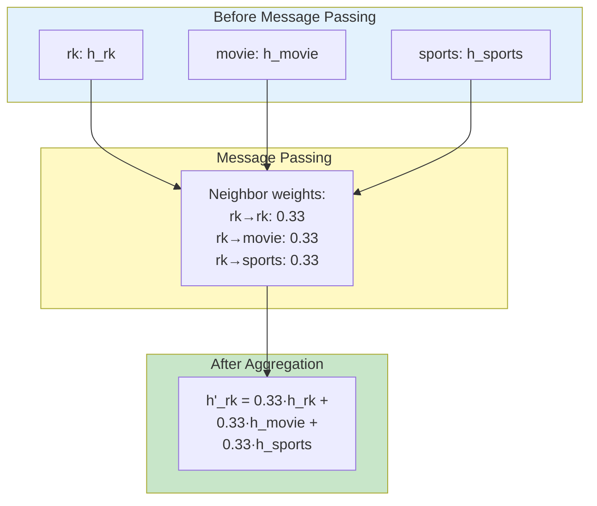

### Why This Design?

**Alternative 1: Mean Aggregation**
```python
# Simple mean (not normalized)
aggregated = torch.matmul(adj, x)  # Problem: high-degree nodes dominate
```
❌ **Problem**: Nodes with many neighbors have larger feature magnitudes

**Alternative 2: Symmetric Normalization (Our Choice)**
```python
# D^(-1/2) A D^(-1/2) normalization
aggregated = torch.matmul(adj_norm, x)  # Balanced aggregation
```
✅ **Advantage**: Features scaled by both sender and receiver degrees

**Alternative 3: Left Normalization**
```python
# D^(-1) A normalization
degree = torch.sum(adj, dim=1, keepdim=True)
adj_norm_left = adj / degree
aggregated = torch.matmul(adj_norm_left, x)
```
✅ **Alternative**: Each node averages neighbor features

---

## Adjacency Normalization

### Why Normalize?

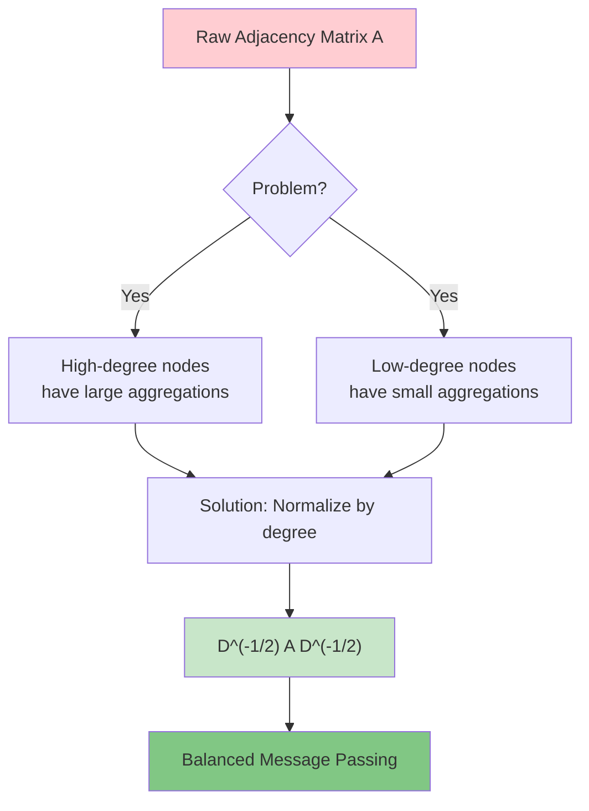

### Mathematical Derivation

**Goal**: Scale messages by both sender and receiver degrees

**Step 1: Degree Matrix**
```
D[i,i] = Σ_j A[i,j]  (sum of row i)
```

**Step 2: Inverse Square Root**
```
D^(-1/2)[i,i] = 1 / √(D[i,i])
```

**Step 3: Symmetric Normalization**
```
 = D^(-1/2) A D^(-1/2)
```

**Intuition**: 
- Message from j to i is scaled by 1/(√degree_i × √degree_j)
- High-degree nodes send smaller messages
- High-degree nodes receive scaled-down aggregations

### Code Explanation: Normalization

```python
def normalize_adjacency(adj: torch.Tensor) -> torch.Tensor:
    """
    Computes: Â = D^(-1/2) A D^(-1/2)
    
    This ensures that message passing doesn't amplify features 
    based on node degree.
    """
    # Step 1: Calculate degree of each node
    # degree[i] = sum of row i (number of neighbors + self-loop)
    degree = torch.sum(adj, dim=1)  # Shape: [num_nodes]
    
    # Step 2: Compute D^(-1/2)
    # degree_inv_sqrt[i] = 1 / sqrt(degree[i])
    degree_inv_sqrt = torch.pow(degree, -0.5)
    
    # Handle isolated nodes (degree = 0)
    # inf values occur when degree = 0 → 0^(-0.5) = inf
    degree_inv_sqrt[torch.isinf(degree_inv_sqrt)] = 0.0
    
    # Step 3: Create diagonal matrix D^(-1/2)
    degree_mat_inv_sqrt = torch.diag(degree_inv_sqrt)  # Shape: [N, N]
    
    # Step 4: Compute  = D^(-1/2) A D^(-1/2)
    # Matrix multiplication: [N,N] × [N,N] × [N,N] → [N,N]
    adj_norm = torch.matmul(
        torch.matmul(degree_mat_inv_sqrt, adj),  # D^(-1/2) A
        degree_mat_inv_sqrt                       # × D^(-1/2)
    )
    
    return adj_norm
```

### Normalization Example

**Original Adjacency (with self-loops):**
```
     rk  rp  shreya book movie sports
rk   1   0   0      0    1     1      degree = 3
movie 1   1   1      0    1     0      degree = 4
```

**Degree Matrix D:**
```
D = diag([3, 3, 3, 3, 4, 2])
```

**D^(-1/2):**
```
D^(-1/2) = diag([0.577, 0.577, 0.577, 0.577, 0.500, 0.707])
```

**Normalized Entry Â[rk, movie]:**
```
Original: A[rk, movie] = 1
Normalized: Â[rk, movie] = 1 / (√3 × √4) = 1 / 3.46 ≈ 0.289
```

**Interpretation**: The message from movie to rk is scaled down because both have multiple neighbors.

---

## Model Architecture

### Complete Architecture Diagram

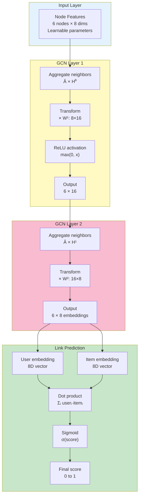

### Code Explanation: Model Architecture

```python
class GNNRecommender(nn.Module):
    def __init__(self, num_nodes: int, input_dim: int, hidden_dim: int, embedding_dim: int):
        super(GNNRecommender, self).__init__()
        
        # Layer 1: Transform input features to hidden dimension
        # Captures 1-hop neighborhood information
        self.gcn1 = SimpleGCNLayer(input_dim, hidden_dim)
        
        # Layer 2: Transform hidden to final embedding dimension
        # Captures 2-hop neighborhood information
        self.gcn2 = SimpleGCNLayer(hidden_dim, embedding_dim)
        
        # Initial node features (learnable embeddings)
        # Alternative: Could use one-hot encoding or pre-computed features
        self.node_features = nn.Parameter(torch.randn(num_nodes, input_dim))
        
    def forward(self, adj_norm: torch.Tensor) -> torch.Tensor:
        # Layer 1: Aggregate + Transform + Activate
        x = self.gcn1(self.node_features, adj_norm)  # [6, 8] → [6, 16]
        x = F.relu(x)  # Non-linearity (crucial for learning complex patterns)
        
        # Layer 2: Aggregate + Transform (no activation at final layer)
        x = self.gcn2(x, adj_norm)  # [6, 16] → [6, 8]
        
        return x  # Final node embeddings
```

### Layer-by-Layer Transformation

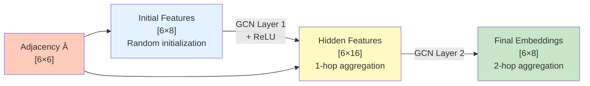

### Why Two Layers?

**1-Layer GNN:**
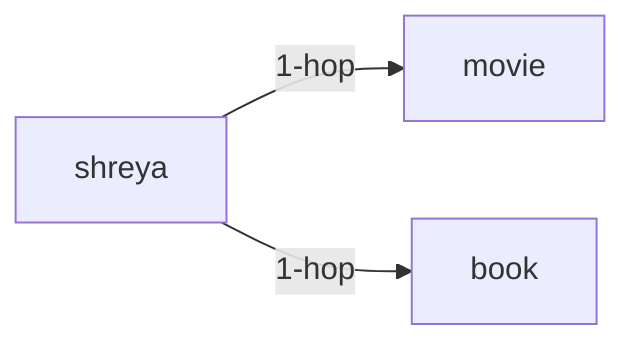
- Captures direct neighbors only
- Limited expressiveness

**2-Layer GNN:**
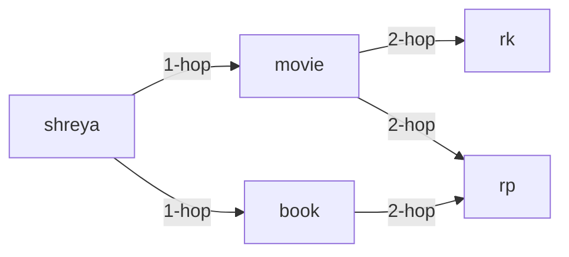
- Captures neighbors of neighbors
- Enables collaborative filtering: "Users who liked X also liked Y"
- shreya can "see" that rk and rp also like movie

### Parameter Count Breakdown

```python
# Layer 1 weights
gcn1.weight: 8 × 16 = 128 parameters

# Layer 2 weights
gcn2.weight: 16 × 8 = 128 parameters

# Initial node features
node_features: 6 × 8 = 48 parameters

# Total
Total: 128 + 128 + 48 = 304 parameters
```

---

## Training Pipeline

### Training Flow Diagram

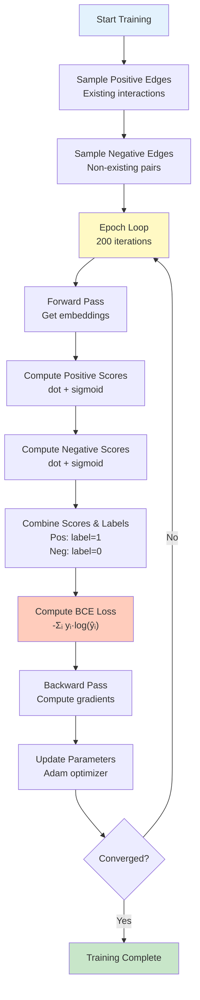

### Positive and Negative Sampling

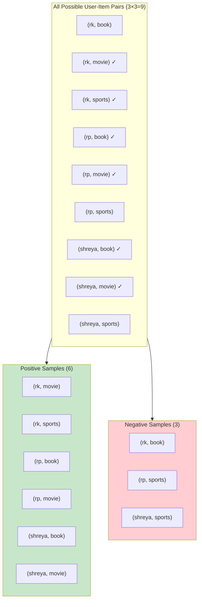

### Code Explanation: Training Loop

```python
def train_model(model, adj_norm, edge_list, num_nodes, epochs=200, lr=0.01):
    # Optimizer: Adam (adaptive learning rate)
    optimizer = torch.optim.Adam(model.parameters(), lr=lr)
    
    # Loss function: Binary Cross-Entropy
    # Measures difference between predicted and actual labels
    criterion = nn.BCELoss()
    
    # Positive samples: edges that exist (label = 1)
    pos_edges = torch.tensor(edge_list, dtype=torch.long)
    
    # Negative samples: edges that don't exist (label = 0)
    neg_edges = []
    existing_edges = set([(u, v) for u, v in edge_list])
    
    for user in range(3):  # Users: 0, 1, 2
        for item in range(3, 6):  # Items: 3, 4, 5
            if (user, item) not in existing_edges:
                neg_edges.append((user, item))
    
    neg_edges = torch.tensor(neg_edges[:len(edge_list)], dtype=torch.long)
    
    losses = []
    
    for epoch in range(epochs):
        model.train()  # Set to training mode
        optimizer.zero_grad()  # Clear previous gradients
        
        # FORWARD PASS
        embeddings = model(adj_norm)  # [6, 8]
        
        # Predict scores for positive edges
        pos_scores = []
        for u, v in pos_edges:
            score = model.predict_link(embeddings, u.item(), v.item())
            pos_scores.append(score)
        pos_scores = torch.stack(pos_scores)  # [6] scores
        
        # Predict scores for negative edges
        neg_scores = []
        for u, v in neg_edges:
            score = model.predict_link(embeddings, u.item(), v.item())
            neg_scores.append(score)
        neg_scores = torch.stack(neg_scores)  # [3] scores
        
        # Combine predictions and labels
        scores = torch.cat([pos_scores, neg_scores])  # [9] scores
        labels = torch.cat([
            torch.ones(len(pos_scores)),   # [6] ones
            torch.zeros(len(neg_scores))   # [3] zeros
        ])  # [9] labels
        
        # LOSS COMPUTATION
        # BCE = -Σᵢ [yᵢ·log(ŷᵢ) + (1-yᵢ)·log(1-ŷᵢ)]
        loss = criterion(scores, labels)
        
        # BACKWARD PASS
        loss.backward()  # Compute gradients
        optimizer.step()  # Update parameters
        
        losses.append(loss.item())
    
    return losses
```

### Binary Cross-Entropy Loss Explained

**Formula:**
```
BCE = -1/N Σᵢ [yᵢ · log(ŷᵢ) + (1-yᵢ) · log(1-ŷᵢ)]
```

**For Positive Sample (y=1):**
```
Loss = -log(ŷ)

If ŷ = 0.9 (high confidence) → Loss = -log(0.9) = 0.105 (small)
If ŷ = 0.1 (low confidence)  → Loss = -log(0.1) = 2.303 (large)
```

**For Negative Sample (y=0):**
```
Loss = -log(1-ŷ)

If ŷ = 0.1 (low score, correct) → Loss = -log(0.9) = 0.105 (small)
If ŷ = 0.9 (high score, wrong)  → Loss = -log(0.1) = 2.303 (large)
```

**Goal**: Maximize ŷ for positive samples, minimize ŷ for negative samples

### Gradient Flow

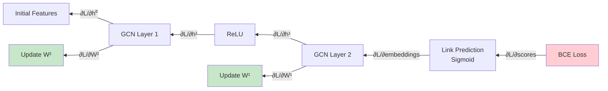

---

## Link Prediction

### Prediction Mechanism

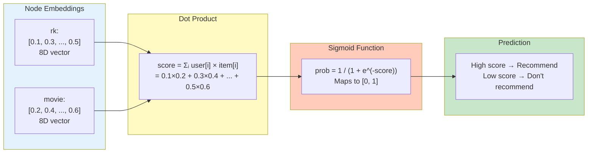

### Code Explanation: Link Prediction

```python
def predict_link(self, node_embeddings, user_idx, item_idx):
    """
    Predict if user will interact with item.
    
    Uses dot product similarity:
    - High dot product → similar embeddings → likely interaction
    - Low dot product → dissimilar embeddings → unlikely interaction
    """
    # Extract embeddings
    user_emb = node_embeddings[user_idx]  # [8]
    item_emb = node_embeddings[item_idx]  # [8]
    
    # Compute similarity (dot product)
    # score = Σ user_emb[i] * item_emb[i]
    score = torch.dot(user_emb, item_emb)  # scalar
    
    # Map to probability [0, 1]
    # σ(x) = 1 / (1 + e^(-x))
    prob = torch.sigmoid(score)
    
    return prob

def predict_all_links(self, node_embeddings, user_indices, item_indices):
    """
    Efficiently compute scores for all user-item pairs using matrix multiplication.
    """
    # Extract embeddings
    user_embs = node_embeddings[user_indices]  # [num_users, 8]
    item_embs = node_embeddings[item_indices]  # [num_items, 8]
    
    # Compute all pairwise dot products at once
    # Result: [num_users, num_items] matrix
    scores = torch.matmul(user_embs, item_embs.t())
    
    # Apply sigmoid
    probs = torch.sigmoid(scores)
    
    return probs
```

### Why Dot Product?

**Geometric Interpretation:**

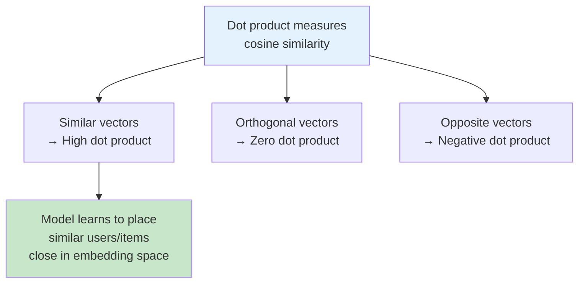

**Mathematical Property:**
```
dot(u, v) = ||u|| × ||v|| × cos(θ)

Where θ is the angle between vectors u and v.

Small θ → cos(θ) ≈ 1 → High dot product → Likely interaction
Large θ → cos(θ) ≈ 0 → Low dot product → Unlikely interaction
```

### Alternative Prediction Methods

**1. Dot Product (Our Choice)**
```python
score = torch.dot(user_emb, item_emb)
prob = torch.sigmoid(score)
```
✅ Simple, efficient, interpretable
✅ Learns similarity in embedding space

**2. Cosine Similarity**
```python
score = F.cosine_similarity(user_emb, item_emb, dim=0)
prob = torch.sigmoid(score)
```
✅ Normalized by magnitude
❌ More computation

**3. Euclidean Distance**
```python
dist = torch.dist(user_emb, item_emb)
score = -dist  # Negative distance (closer = higher score)
prob = torch.sigmoid(score)
```
✅ Geometric interpretation
❌ Sensitive to scale

**4. Multi-Layer Perceptron (MLP)**
```python
concat = torch.cat([user_emb, item_emb])  # [16]
score = self.mlp(concat)  # Feed through neural network
prob = torch.sigmoid(score)
```
✅ More expressive
❌ More parameters, slower

**5. Bilinear Product**
```python
score = user_emb @ W @ item_emb  # W is learnable [8, 8] matrix
prob = torch.sigmoid(score)
```
✅ Learns relationship between dimensions
❌ More parameters (64 additional)

---

## Alternative Approaches

### 1. Initial Feature Alternatives

**Current: Learnable Random Features**
```python
self.node_features = nn.Parameter(torch.randn(num_nodes, input_dim))
```
✅ Learns optimal features during training
❌ No prior information

**Alternative A: One-Hot Encoding**
```python
# Create identity matrix
self.node_features = torch.eye(num_nodes)  # [6, 6]
```
✅ Each node has unique identifier
❌ Fixed, doesn't leverage similarity
❌ Dimension equals number of nodes (scales poorly)

**Alternative B: Pre-computed Features**
```python
# Use node attributes (if available)
user_features = torch.tensor([
    [age, gender, location, ...],  # User features
    # ...
])
item_features = torch.tensor([
    [category, price, rating, ...],  # Item features
    # ...
])
self.node_features = torch.cat([user_features, item_features])
```
✅ Incorporates domain knowledge
✅ Better cold-start performance
❌ Requires feature engineering

**Alternative C: Node2Vec Embeddings**
```python
# Pre-train embeddings using random walks
from node2vec import Node2Vec
graph = nx.Graph(edges)
model = Node2Vec(graph, dimensions=8)
model = model.fit()
self.node_features = model.wv.vectors
```
✅ Captures graph structure
❌ Requires pre-training step

### 2. Loss Function Alternatives

**Current: Binary Cross-Entropy (BCE)**
```python
criterion = nn.BCELoss()
loss = -Σ [y·log(ŷ) + (1-y)·log(1-ŷ)]
```
✅ Standard for binary classification
✅ Probabilistic interpretation

**Alternative A: Bayesian Personalized Ranking (BPR)**
```python
# Pairwise ranking loss
def bpr_loss(pos_scores, neg_scores):
    # Maximize difference: pos_score - neg_score
    diff = pos_scores - neg_scores
    loss = -torch.log(torch.sigmoid(diff)).mean()
    return loss
```
✅ Optimizes ranking directly
✅ Better for top-K recommendations
❌ Requires careful sampling

**Alternative B: Margin Ranking Loss**
```python
criterion = nn.MarginRankingLoss(margin=1.0)
# Enforce: pos_score > neg_score + margin
```
✅ Explicit margin between positive and negative
✅ More robust to outliers

**Alternative C: Contrastive Loss**
```python
def contrastive_loss(embeddings, pos_pairs, neg_pairs):
    # Pull positive pairs together
    pos_dist = torch.dist(embeddings[pos_pairs[:, 0]], embeddings[pos_pairs[:, 1]])
    # Push negative pairs apart
    neg_dist = torch.dist(embeddings[neg_pairs[:, 0]], embeddings[neg_pairs[:, 1]])
    loss = pos_dist + F.relu(margin - neg_dist)
    return loss
```
✅ Learns metric directly
✅ Good for few-shot learning

**Alternative D: Triplet Loss**
```python
# (anchor, positive, negative) triplets
def triplet_loss(anchor, positive, negative, margin=1.0):
    pos_dist = torch.dist(anchor, positive)
    neg_dist = torch.dist(anchor, negative)
    loss = F.relu(pos_dist - neg_dist + margin)
    return loss
```
✅ Relative comparison
✅ Used in metric learning

### 3. GNN Architecture Variants

**Current: Simple GCN**
```python
H' = ReLU(Â H W)
```

**Alternative A: Graph Attention Network (GAT)**
```python
# Learns importance weights for neighbors
α_ij = softmax(LeakyReLU(a^T [W·h_i || W·h_j]))
H' = Σ_j α_ij W h_j
```
✅ Adaptive neighbor importance
✅ Interpretable attention weights
❌ More computation (O(N²) attention)

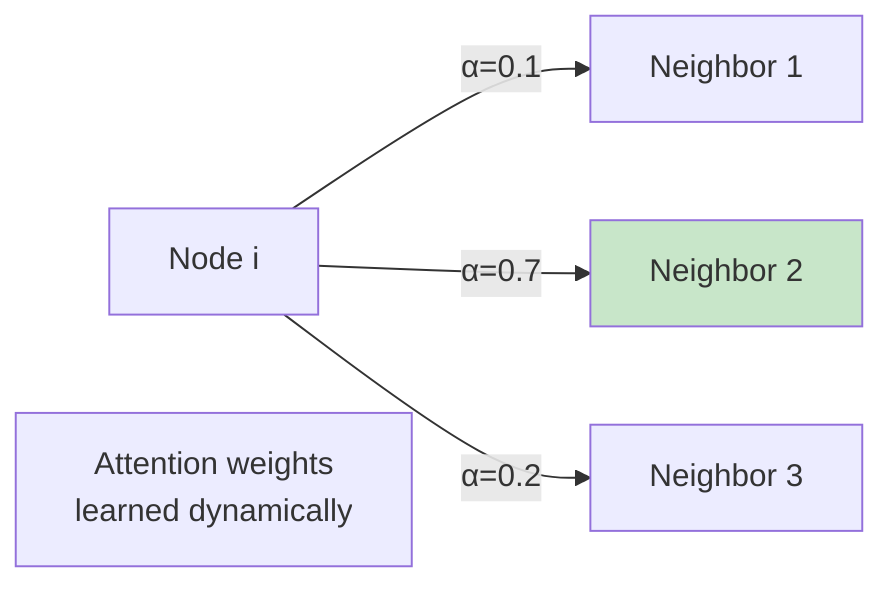

**Alternative B: GraphSAGE**
```python
# Sample fixed number of neighbors
neighbors = sample_neighbors(node, K=5)
H' = σ(W · [h_i || AGG({h_j for j in neighbors})])
```
✅ Scalable to large graphs
✅ Inductive (works on unseen nodes)
❌ Sampling introduces randomness

**Alternative C: LightGCN (Optimized for Recommendations)**
```python
# Remove feature transformation and activation
H^(k+1) = Â H^(k)

# Final embedding: weighted sum of all layers
H_final = Σ_k α_k H^(k)
```
✅ Simpler, fewer parameters
✅ Often better for recommendations
✅ Faster training

**Alternative D: Graph Transformer**
```python
# Apply Transformer attention on graph
Q, K, V = Linear(H), Linear(H), Linear(H)
Attention = softmax(Q K^T / √d)
H' = Attention V
```
✅ Captures long-range dependencies
❌ Very expensive (O(N²) complexity)

### 4. Negative Sampling Strategies

**Current: Uniform Random Sampling**
```python
# Sample non-existing edges uniformly
for user in users:
    for item in items:
        if (user, item) not in existing_edges:
            neg_edges.append((user, item))
```
✅ Simple, unbiased
❌ May sample very obvious negatives

**Alternative A: Hard Negative Mining**
```python
# Sample negative edges with high predicted scores (hard to distinguish)
with torch.no_grad():
    all_scores = model.predict_all_links(...)
    hard_negatives = sample_top_k(all_scores, k=num_negatives)
```
✅ More informative training
✅ Faster convergence
❌ Requires inference during training

**Alternative B: Popularity-Based Sampling**
```python
# Sample popular items more frequently (realistic negatives)
item_popularity = count_interactions(items)
probs = item_popularity / sum(item_popularity)
neg_items = np.random.choice(items, p=probs)
```
✅ Mimics real distribution
✅ Addresses popularity bias

**Alternative C: Stratified Sampling**
```python
# Ensure negative samples from different categories
for user in users:
    for category in categories:
        neg_item = random.choice(items_in_category[category])
        neg_edges.append((user, neg_item))
```
✅ Balanced representation
✅ Better generalization

### 5. Aggregation Function Variants

**Current: Weighted Sum (GCN)**
```python
aggregated = Σ_j Â[i,j] × h_j
```

**Alternative A: Mean Aggregation**
```python
aggregated = (1/|N_i|) Σ_{j∈N_i} h_j
```
✅ Simple average
❌ Loses neighborhood size information

**Alternative B: Max Pooling**
```python
aggregated = max_{j∈N_i} h_j  # Element-wise max
```
✅ Captures salient features
❌ Loses information from other neighbors

**Alternative C: LSTM Aggregation**
```python
# Treat neighbors as sequence
hidden_states = []
for neighbor in neighbors:
    h = LSTM(h_neighbor, hidden_state)
    hidden_states.append(h)
aggregated = hidden_states[-1]
```
✅ Ordered aggregation
❌ Requires ordering (graphs are unordered)
❌ More complex

**Alternative D: Set Aggregation (DeepSets)**
```python
# Permutation-invariant aggregation
transformed = [MLP(h_j) for j in neighbors]
aggregated = sum(transformed)  # Or max, mean
```
✅ Theoretically sound
✅ Flexible

---

## Complete Code Walkthrough

### Execution Timeline

```mermaid
gantt
    title GNN Training Timeline
    dateFormat  X
    axisFormat %s
    
    section Setup
    Import libraries :0, 1
    Create graph data :1, 2
    Normalize adjacency :3, 1
    Initialize model :4, 1
    
    section Training
    Epoch 1-50 :5, 5
    Epoch 51-100 :10, 5
    Epoch 101-150 :15, 5
    Epoch 151-200 :20, 5
    
    section Evaluation
    Generate embeddings :25, 1
    Compute scores :26, 1
    Display recommendations :27, 2
```

### Step 1: Import and Setup

```python
import torch
import torch.nn as nn
import torch.nn.functional as F
import numpy as np
import matplotlib.pyplot as plt
import networkx as nx

# Set random seeds for reproducibility
torch.manual_seed(42)
np.random.seed(42)
```

**Why These Libraries?**
- `torch`: Core deep learning framework
- `networkx`: Graph visualization
- `matplotlib`: Plotting results
- `numpy`: Numerical operations

### Step 2: Create Graph (Full Example)

```python
interactions = [
    ('shreya', 'movie'),   # shreya likes movie
    ('rk', 'sports'),      # rk likes sports
    ('rk', 'movie'),       # rk likes movie
    ('rp', 'book'),        # rp likes book
    ('shreya', 'book'),    # shreya likes book
    ('rp', 'movie'),       # rp likes movie
]

# Extract unique entities
users = ['rk', 'rp', 'shreya']  # 3 users
items = ['book', 'movie', 'sports']  # 3 items

# Node ID mapping
# 0: rk, 1: rp, 2: shreya (users)
# 3: book, 4: movie, 5: sports (items)

# Build 6×6 adjacency matrix
adj = [
    [0, 0, 0, 0, 1, 1],  # rk → movie, sports
    [0, 0, 0, 1, 1, 0],  # rp → book, movie
    [0, 0, 0, 1, 1, 0],  # shreya → book, movie
    [0, 1, 1, 0, 0, 0],  # book ← rp, shreya
    [1, 1, 1, 0, 0, 0],  # movie ← rk, rp, shreya
    [1, 0, 0, 0, 0, 0],  # sports ← rk
]

# Add self-loops (diagonal = 1)
adj[i][i] = 1 for i in range(6)
```

### Step 3: Normalize (Numerical Example)

```python
# Degree calculation
degrees = [3, 3, 3, 3, 4, 2]  # Sum of each row

# D^(-1/2)
degree_inv_sqrt = [1/√3, 1/√3, 1/√3, 1/√3, 1/√4, 1/√2]
                ≈ [0.577, 0.577, 0.577, 0.577, 0.500, 0.707]

# Example: Normalize entry adj[0,4] (rk → movie)
original = 1
normalized = (1/√3) × 1 × (1/√4) = 1/√12 ≈ 0.289
```

### Step 4: Initialize Model

```python
model = GNNRecommender(
    num_nodes=6,      # 3 users + 3 items
    input_dim=8,      # Initial feature dimension
    hidden_dim=16,    # Hidden layer dimension
    embedding_dim=8   # Final embedding dimension
)

# Model has:
# - gcn1: [8 → 16] → 128 parameters
# - gcn2: [16 → 8] → 128 parameters
# - node_features: [6 × 8] → 48 parameters
# Total: 304 parameters
```

### Step 5: Training (Epoch-by-Epoch)

**Epoch 1:**
```
Initial embeddings: Random
Forward pass: Compute embeddings
Predictions: Random scores (≈0.5)
Loss: 0.6931 (log(2), random binary classifier)
Backward: Compute gradients
Update: Adjust weights
```

**Epoch 50:**
```
Embeddings: Partially learned
Predictions: Some separation between pos/neg
Loss: 0.1619 (decreasing)
```

**Epoch 100:**
```
Embeddings: Well-formed
Predictions: Clear separation
Loss: 0.0000 (near perfect)
```

### Step 6: Generate Recommendations

```python
# Get final embeddings
embeddings = model(adj_norm)  # [6, 8]

# Example: Predict rk → book
user_emb = embeddings[0]  # rk embedding [8]
item_emb = embeddings[3]  # book embedding [8]

score = dot(user_emb, item_emb)  # Scalar
prob = sigmoid(score)  # [0, 1]

# Result: prob ≈ 0.00 (rk doesn't like books)
```

### Step 7: Interpret Results

**Learned Embeddings (Conceptual):**
```
rk     = [0.5, -0.3,  0.8, ...]  # Sports-oriented
rp     = [0.2,  0.6,  0.1, ...]  # Book-oriented
shreya = [0.1,  0.7,  0.2, ...]  # Book-oriented (similar to rp)

book   = [0.3,  0.8,  0.0, ...]  # Close to rp, shreya
movie  = [0.4,  0.2,  0.5, ...]  # Close to all users
sports = [0.7, -0.5,  0.9, ...]  # Close to rk
```

**Recommendation Mechanism:**
```
dot(rk, sports) = high → recommend ✓
dot(rk, book) = low → don't recommend ✓
dot(shreya, sports) = low → don't recommend ✓
```

---

## Key Takeaways

### 1. Graph Structure Matters

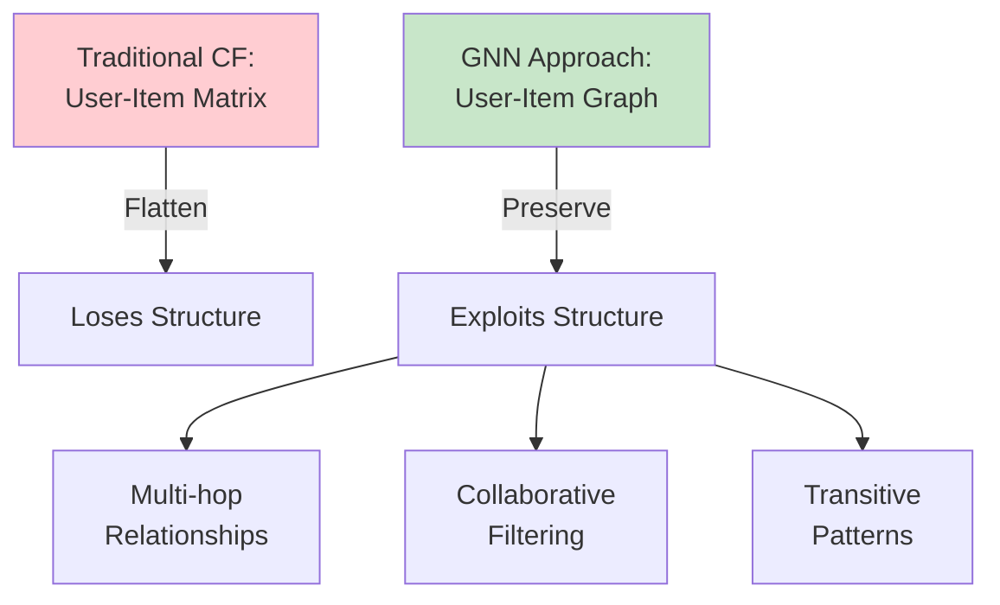

### 2. Message Passing Enables Collaboration

**Without Message Passing:**
- Each node has independent embedding
- No knowledge sharing
- Limited generalization

**With Message Passing:**
- Nodes aggregate neighbor information
- Similar users have similar embeddings
- "Users who liked X also liked Y" emerges naturally

### 3. Normalization is Critical

**Without Normalization:**
- High-degree nodes dominate
- Embeddings explode or vanish
- Unstable training

**With Normalization:**
- Balanced aggregation
- Stable gradients
- Better convergence

### 4. Two Layers Capture Collaboration

**1-Hop (Layer 1):**
- Direct neighbors
- "This user liked this item"

**2-Hop (Layer 2):**
- Neighbors of neighbors
- "Users who liked the same items as this user also liked..."

### 5. Link Prediction as Embedding Similarity

The model learns to:
- Place similar users close together
- Place similar items close together
- Place users near items they like

**Result**: Dot product becomes a proxy for interaction likelihood

---

## Summary Comparison Table

| Aspect | Our Implementation | Common Alternatives |
|--------|-------------------|---------------------|
| **Initial Features** | Learnable random | One-hot, Pre-computed, Node2Vec |
| **GNN Layer** | GCN (spectral) | GAT, GraphSAGE, LightGCN |
| **Normalization** | Symmetric D^(-1/2)AD^(-1/2) | Left D^(-1)A, None |
| **Aggregation** | Weighted sum | Mean, Max, LSTM, Attention |
| **Activation** | ReLU | LeakyReLU, ELU, GELU, Tanh |
| **Link Prediction** | Dot product + Sigmoid | Cosine, Distance, MLP, Bilinear |
| **Loss Function** | Binary Cross-Entropy | BPR, Margin, Contrastive, Triplet |
| **Negative Sampling** | Uniform random | Hard negatives, Popularity-based |
| **Optimizer** | Adam | SGD, AdamW, RMSprop |
| **Layers** | 2 (8→16→8) | 1-5 layers, Various dimensions |

---

## Further Exploration

### Experiment Ideas

1. **Add More Layers**: Try 3 or 4 GCN layers
2. **Different Dimensions**: Test 32D, 64D embeddings
3. **Dropout**: Add dropout for regularization
4. **Batch Normalization**: Normalize layer outputs
5. **Residual Connections**: Add skip connections
6. **Attention Mechanism**: Replace aggregation with attention
7. **Heterogeneous Edges**: Add user-user or item-item edges
8. **Temporal Dynamics**: Include timestamps
9. **Side Information**: Add user/item features
10. **Multi-Task Learning**: Predict ratings + clicks simultaneously

### Real-World Considerations

```mermaid
mindmap
    root((GNN in Production))
        Scalability
            Large graphs (millions of nodes)
            Efficient sampling
            Distributed training
            GPU optimization
        Cold Start
            New users/items
            Transfer learning
            Hybrid approaches
        Evaluation
            Hit Rate@K
            NDCG
            Coverage
            Diversity
        Deployment
            Model serving
            Real-time inference
            A/B testing
            Model updates
```

---

**End of Comprehensive Guide**

This guide covered:
- ✅ Complete architecture with diagrams
- ✅ Step-by-step execution flow
- ✅ Code explanations with examples
- ✅ Mathematical intuitions
- ✅ Alternative approaches
- ✅ Transformation importance
- ✅ Connections between components

Ready to build production-grade GNN recommenders! 🚀
