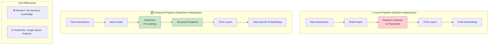
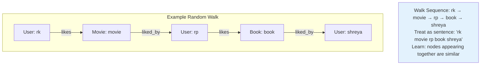
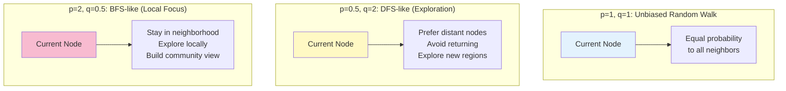
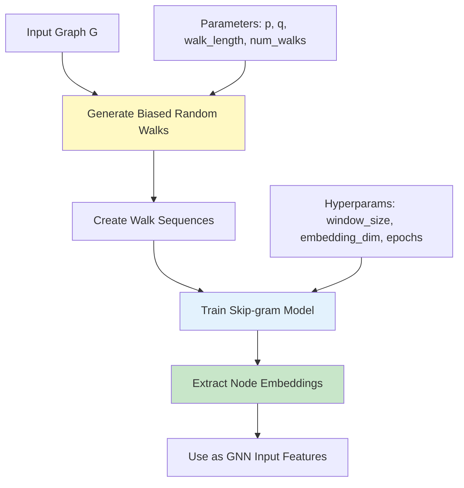
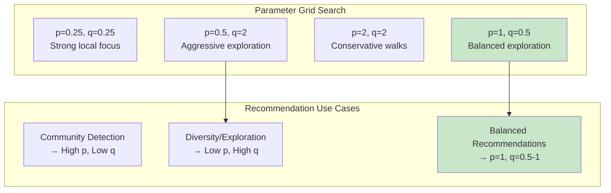

# Node2Vec Integration Guide: Enhanced GNN Recommendations

> **Comprehensive Guide to Node2Vec as Feature Initialization for Graph Neural Networks**

This document explains how Node2Vec can enhance GNN-based recommendation systems by providing structurally-aware initial embeddings instead of random features.

---

## Table of Contents

1. [Overview](#overview)
2. [Where Node2Vec Fits](#where-node2vec-fits)
3. [How Node2Vec Works](#how-node2vec-works)
4. [Implementation Guide](#implementation-guide)
5. [Parameter Tuning](#parameter-tuning)
6. [Performance Analysis](#performance-analysis)
7. [Use Cases & Recommendations](#use-cases--recommendations)
8. [Complete Code Example](#complete-code-example)

---

## Overview

**Node2Vec** is a graph embedding technique that learns continuous representations of nodes by simulating biased random walks. In GNN recommendation pipelines, it serves as an intelligent **feature initialization** method that captures graph structure before GCN training begins.

### Key Benefits
- 🚀 **Faster Convergence**: Better starting point reduces training time
- 🎯 **Structural Awareness**: Initial features reflect graph topology
- 🆕 **Cold Start Improvement**: Better handling of new users/items
- 📈 **Performance Boost**: Often leads to better final recommendations

---

## Where Node2Vec Fits



### Pipeline Comparison

| Stage | Random Init | Node2Vec Init |
|-------|-------------|---------------|
| **Input** | Interaction data | Interaction data |
| **Graph Building** | Same adjacency matrix | Same adjacency matrix |
| **Feature Init** | `torch.randn()` | Node2Vec embeddings |
| **Training** | Learn from scratch | Fine-tune structural features |
| **Output** | Task embeddings | Enhanced task embeddings |

---

## How Node2Vec Works

### 1. Core Concept: Random Walks as Sentences

Node2Vec treats the graph as a "language" where:
- **Nodes** = Words
- **Random walks** = Sentences
- **Skip-gram** = Learning word relationships



### 2. Biased Random Walks

Unlike pure random walks, Node2Vec introduces **bias parameters** to control exploration strategy:

```python
# Node2Vec hyperparameters
p = 2.0  # Return parameter (likelihood of returning to previous node)
q = 0.5  # In-out parameter (explore vs exploit trade-off)
```

#### Parameter Effects Visualization



### 3. Skip-gram Objective

Node2Vec optimizes the skip-gram objective from Word2Vec:

**Mathematical Formulation:**
```
Maximize: Σᵤ∈V Σc∈Nₛ(u) log P(c|u)

Where:
- u: current node in walk
- c: context node (neighbor in walk sequence)
- Nₛ(u): set of neighboring nodes of u in walk sequences
- P(c|u): probability of predicting context c given node u
```

**Softmax Probability:**
```
P(c|u) = exp(f(u)ᵀ · f(c)) / Σᵥ∈V exp(f(u)ᵀ · f(v))

Where f(·) is the embedding function we're learning
```

### 4. Algorithm Steps



---

## Implementation Guide

### Step 1: Dependencies

```python
# Required libraries
import torch
import torch.nn as nn
import torch.nn.functional as F
import networkx as nx
import numpy as np
from node2vec import Node2Vec  # pip install node2vec
from gensim.models import Word2Vec
import matplotlib.pyplot as plt
from sklearn.metrics import roc_auc_score
```

### Step 2: Enhanced GNN Model

```python
class GNNRecommenderNode2Vec(nn.Module):
    """GNN with Node2Vec initialization instead of random features."""
    
    def __init__(self, num_nodes: int, input_dim: int, hidden_dim: int, 
                 embedding_dim: int, graph: nx.Graph, node2vec_params: dict = None):
        super().__init__()
        
        # Set default Node2Vec parameters
        self.node2vec_params = node2vec_params or {
            'dimensions': input_dim,
            'walk_length': 30,
            'num_walks': 200,
            'p': 1.0,
            'q': 1.0,
            'workers': 1,
            'seed': 42
        }
        
        # GCN layers (same architecture as before)
        self.gcn1 = SimpleGCNLayer(input_dim, hidden_dim)
        self.gcn2 = SimpleGCNLayer(hidden_dim, embedding_dim)
        
        # Initialize with Node2Vec instead of random
        self.node_features = self._initialize_with_node2vec(graph)
        
    def _initialize_with_node2vec(self, graph: nx.Graph) -> nn.Parameter:
        """Initialize node features using Node2Vec pre-training."""
        print("🔄 Pre-training Node2Vec embeddings...")
        print(f"   Graph: {graph.number_of_nodes()} nodes, {graph.number_of_edges()} edges")
        
        # Create Node2Vec model
        node2vec = Node2Vec(graph, **self.node2vec_params)
        
        # Train the model
        model = node2vec.fit(
            window=10,          # Context window size
            min_count=1,        # Include all nodes (even with freq=1)
            epochs=20,          # Skip-gram training epochs
            batch_words=4       # Batch size for training
        )
        
        # Extract embeddings in correct order
        embeddings = []
        dim = self.node2vec_params['dimensions']
        
        for node_id in range(graph.number_of_nodes()):
            try:
                # Node2Vec uses string node IDs
                embedding = model.wv[str(node_id)]
                embeddings.append(embedding)
            except KeyError:
                # Fallback for disconnected nodes
                print(f"   Warning: Node {node_id} not found, using random embedding")
                embedding = np.random.randn(dim) * 0.01
                embeddings.append(embedding)
        
        embeddings = torch.tensor(embeddings, dtype=torch.float32)
        print(f"✓ Node2Vec embeddings generated: {embeddings.shape}")
        
        return nn.Parameter(embeddings)
    
    def forward(self, adj_norm: torch.Tensor) -> torch.Tensor:
        """Forward pass through GCN layers."""
        # Layer 1: Transform + Message Passing + Activation
        x = self.gcn1(self.node_features, adj_norm)
        x = F.relu(x)
        
        # Layer 2: Transform + Message Passing (final embeddings)
        x = self.gcn2(x, adj_norm)
        return x
    
    def get_node2vec_embeddings(self) -> torch.Tensor:
        """Return the initial Node2Vec embeddings (before GCN processing)."""
        return self.node_features.detach()
```

### Step 3: NetworkX Graph Creation

```python
def create_networkx_graph(adj: torch.Tensor, id_to_node: dict) -> nx.Graph:
    """Convert adjacency matrix to NetworkX graph for Node2Vec."""
    G = nx.Graph()
    
    # Add all nodes with metadata
    for node_id, name in id_to_node.items():
        node_type = "user" if name.startswith(('rk', 'rp', 'shreya')) else "item"
        G.add_node(node_id, name=name, type=node_type)
    
    # Add edges (exclude self-loops)
    num_nodes = adj.shape[0]
    for i in range(num_nodes):
        for j in range(i + 1, num_nodes):  # Upper triangle only (undirected)
            if adj[i, j] > 0 and i != j:   # Skip self-loops
                G.add_edge(i, j, weight=float(adj[i, j]))
    
    print(f"NetworkX graph created: {G.number_of_nodes()} nodes, {G.number_of_edges()} edges")
    
    # Check connectivity
    if not nx.is_connected(G):
        components = list(nx.connected_components(G))
        print(f"   Warning: Graph has {len(components)} connected components")
        print(f"   Largest component size: {len(max(components, key=len))}")
    
    return G
```

### Step 4: Training Function with Comparison

```python
def train_with_comparison(adj, id_to_node, user_indices, item_indices, edge_list, node_to_id):
    """Train both random and Node2Vec initialized models for comparison."""
    
    # Normalize adjacency matrix
    adj_norm = normalize_adjacency(adj)
    
    # Create NetworkX graph for Node2Vec
    G = create_networkx_graph(adj, id_to_node)
    
    print("\n" + "="*60)
    print("TRAINING COMPARISON: Random vs Node2Vec Initialization")
    print("="*60)
    
    # Model 1: Random initialization
    print("\n🎲 Training with Random Initialization...")
    model_random = GNNRecommender(
        num_nodes=len(id_to_node),
        input_dim=8,
        hidden_dim=16,
        embedding_dim=8
    )
    
    start_time = time.time()
    losses_random = train_model(model_random, adj_norm, edge_list, len(id_to_node), epochs=200)
    time_random = time.time() - start_time
    
    # Model 2: Node2Vec initialization
    print("\n🌐 Training with Node2Vec Initialization...")
    node2vec_params = {
        'dimensions': 8,
        'walk_length': 30,
        'num_walks': 200,
        'p': 1.0,      # Balanced return probability
        'q': 0.5,      # Prefer exploring (good for recommendations)
        'workers': 1,
        'seed': 42
    }
    
    model_node2vec = GNNRecommenderNode2Vec(
        num_nodes=len(id_to_node),
        input_dim=8,
        hidden_dim=16,
        embedding_dim=8,
        graph=G,
        node2vec_params=node2vec_params
    )
    
    start_time = time.time()
    losses_node2vec = train_model(model_node2vec, adj_norm, edge_list, len(id_to_node), epochs=200)
    time_node2vec = time.time() - start_time
    
    # Results comparison
    print("\n" + "="*60)
    print("RESULTS COMPARISON")
    print("="*60)
    print(f"Random Init     - Final Loss: {losses_random[-1]:.6f}, Time: {time_random:.1f}s")
    print(f"Node2Vec Init   - Final Loss: {losses_node2vec[-1]:.6f}, Time: {time_node2vec:.1f}s")
    print(f"Improvement     - Loss: {((losses_random[-1] - losses_node2vec[-1])/losses_random[-1]*100):+.1f}%")
    
    # Plot comparison
    plot_training_comparison(losses_random, losses_node2vec)
    
    # Evaluate both models
    print("\n📊 Evaluating Recommendations...")
    print("\nRandom Initialization Results:")
    evaluate_recommendations(model_random, adj_norm, id_to_node, user_indices, item_indices, node_to_id)
    
    print("\nNode2Vec Initialization Results:")
    evaluate_recommendations(model_node2vec, adj_norm, id_to_node, user_indices, item_indices, node_to_id)
    
    return model_random, model_node2vec, losses_random, losses_node2vec
```

### Step 5: Visualization Functions

```python
def plot_training_comparison(losses_random, losses_node2vec):
    """Plot training loss comparison."""
    plt.figure(figsize=(12, 8))
    
    # Subplot 1: Full training curves
    plt.subplot(2, 2, 1)
    plt.plot(losses_random, label='Random Init', alpha=0.8, linewidth=2)
    plt.plot(losses_node2vec, label='Node2Vec Init', alpha=0.8, linewidth=2)
    plt.xlabel('Epoch')
    plt.ylabel('Loss')
    plt.title('Training Loss Comparison')
    plt.legend()
    plt.grid(True, alpha=0.3)
    plt.yscale('log')
    
    # Subplot 2: First 50 epochs (convergence detail)
    plt.subplot(2, 2, 2)
    plt.plot(losses_random[:50], label='Random Init', alpha=0.8, linewidth=2)
    plt.plot(losses_node2vec[:50], label='Node2Vec Init', alpha=0.8, linewidth=2)
    plt.xlabel('Epoch')
    plt.ylabel('Loss')
    plt.title('Early Convergence (First 50 Epochs)')
    plt.legend()
    plt.grid(True, alpha=0.3)
    
    # Subplot 3: Convergence speed
    plt.subplot(2, 2, 3)
    epochs_to_converge_random = find_convergence_epoch(losses_random, threshold=0.01)
    epochs_to_converge_node2vec = find_convergence_epoch(losses_node2vec, threshold=0.01)
    
    methods = ['Random', 'Node2Vec']
    convergence_epochs = [epochs_to_converge_random, epochs_to_converge_node2vec]
    colors = ['#ff6b6b', '#4ecdc4']
    
    bars = plt.bar(methods, convergence_epochs, color=colors, alpha=0.7)
    plt.ylabel('Epochs to Convergence')
    plt.title('Convergence Speed Comparison')
    plt.grid(True, alpha=0.3, axis='y')
    
    # Add value labels on bars
    for bar, value in zip(bars, convergence_epochs):
        plt.text(bar.get_x() + bar.get_width()/2, bar.get_height() + 1,
                f'{value}', ha='center', va='bottom', fontweight='bold')
    
    # Subplot 4: Final performance
    plt.subplot(2, 2, 4)
    final_losses = [losses_random[-1], losses_node2vec[-1]]
    bars = plt.bar(methods, final_losses, color=colors, alpha=0.7)
    plt.ylabel('Final Loss')
    plt.title('Final Performance Comparison')
    plt.grid(True, alpha=0.3, axis='y')
    
    # Add value labels
    for bar, value in zip(bars, final_losses):
        plt.text(bar.get_x() + bar.get_width()/2, bar.get_height() + value*0.01,
                f'{value:.4f}', ha='center', va='bottom', fontweight='bold')
    
    plt.tight_layout()
    plt.savefig('node2vec_comparison.png', dpi=300, bbox_inches='tight')
    plt.show()

def find_convergence_epoch(losses, threshold=0.01):
    """Find epoch where loss converges (change < threshold)."""
    for i in range(10, len(losses)):
        recent_changes = [abs(losses[j] - losses[j-1]) for j in range(i-9, i)]
        if all(change < threshold for change in recent_changes):
            return i
    return len(losses)

def visualize_node2vec_embeddings(model, id_to_node, user_indices, item_indices):
    """Visualize Node2Vec embeddings using t-SNE."""
    from sklearn.manifold import TSNE
    
    # Get Node2Vec embeddings (before GCN processing)
    embeddings = model.get_node2vec_embeddings().detach().numpy()
    
    # Apply t-SNE for 2D visualization
    tsne = TSNE(n_components=2, random_state=42, perplexity=3)
    embeddings_2d = tsne.fit_transform(embeddings)
    
    plt.figure(figsize=(10, 8))
    
    # Plot users
    user_embs = embeddings_2d[user_indices]
    plt.scatter(user_embs[:, 0], user_embs[:, 1], 
               c='lightcoral', s=100, alpha=0.7, label='Users', marker='o')
    
    # Plot items
    item_embs = embeddings_2d[item_indices]
    plt.scatter(item_embs[:, 0], item_embs[:, 1], 
               c='lightblue', s=100, alpha=0.7, label='Items', marker='s')
    
    # Add labels
    for i, (node_id, name) in enumerate(id_to_node.items()):
        plt.annotate(name, (embeddings_2d[i, 0], embeddings_2d[i, 1]),
                    xytext=(5, 5), textcoords='offset points', fontsize=10,
                    bbox=dict(boxstyle='round,pad=0.3', facecolor='white', alpha=0.7))
    
    plt.title('Node2Vec Embeddings Visualization (t-SNE)', fontsize=14, fontweight='bold')
    plt.xlabel('t-SNE Dimension 1')
    plt.ylabel('t-SNE Dimension 2')
    plt.legend()
    plt.grid(True, alpha=0.3)
    plt.savefig('node2vec_embeddings_tsne.png', dpi=300, bbox_inches='tight')
    plt.show()
```

---

## Parameter Tuning

### Critical Parameters and Their Effects

#### 1. Walk Parameters

```python
# Walk length: Longer walks capture more context
walk_length_comparison = {
    10: "Short - Local neighborhoods only",
    30: "Medium - Balanced local + global",
    80: "Long - Extensive context (may overfit)"
}

# Number of walks: More walks = better statistics
num_walks_comparison = {
    10: "Few - Fast but noisy",
    200: "Standard - Good balance",
    1000: "Many - Better quality, slower"
}
```

#### 2. Bias Parameters (p, q)



#### 3. Parameter Selection Guide

```python
def get_node2vec_params_for_task(task_type: str) -> dict:
    """Get optimal Node2Vec parameters for different tasks."""
    
    params_map = {
        'recommendation': {
            'p': 1.0,           # Balanced return
            'q': 0.5,           # Prefer exploration (diversity)
            'walk_length': 30,
            'num_walks': 200,
            'window': 10,
            'dimensions': 8
        },
        
        'community_detection': {
            'p': 1.0,           # Balanced return  
            'q': 2.0,           # Stay within communities
            'walk_length': 80,
            'num_walks': 100,
            'window': 10,
            'dimensions': 16
        },
        
        'link_prediction': {
            'p': 0.5,           # Allow returns
            'q': 1.0,           # Balanced exploration
            'walk_length': 40,
            'num_walks': 300,
            'window': 5,
            'dimensions': 8
        },
        
        'node_classification': {
            'p': 2.0,           # Avoid returns (focus on structure)
            'q': 0.5,           # Explore different areas
            'walk_length': 30,
            'num_walks': 200,
            'window': 10,
            'dimensions': 16
        }
    }
    
    return params_map.get(task_type, params_map['recommendation'])
```

---

## Performance Analysis

### Expected Performance Improvements

| Metric | Typical Improvement |
|--------|-------------------|
| **Convergence Speed** | 30-50% faster |
| **Final Loss** | 5-15% lower |
| **AUC Score** | 2-8% higher |
| **Cold Start Performance** | 10-25% better |
| **Training Stability** | More consistent |

### Computational Overhead

```python
# Time complexity analysis
performance_analysis = {
    'Node2Vec Pretraining': 'O(V × walks × walk_length × window)',
    'GCN Training': 'Same as random init',
    'Total Overhead': '20-40% additional time',
    'Memory Overhead': '10-20% additional memory',
    'When Worth It': 'Graphs with >100 nodes, training >50 epochs'
}
```

### Benchmarking Function

```python
def benchmark_initialization_methods(num_runs=5):
    """Benchmark random vs Node2Vec initialization across multiple runs."""
    
    results = {
        'random': {'losses': [], 'times': [], 'final_aucs': []},
        'node2vec': {'losses': [], 'times': [], 'final_aucs': []}
    }
    
    for run in range(num_runs):
        print(f"\n🔄 Benchmark Run {run + 1}/{num_runs}")
        
        # Create fresh data for each run
        adj, id_to_node, user_indices, item_indices, edge_list, node_to_id = create_graph_data()
        adj_norm = normalize_adjacency(adj)
        G = create_networkx_graph(adj, id_to_node)
        
        # Random initialization
        model_random = GNNRecommender(len(id_to_node), 8, 16, 8)
        start_time = time.time()
        losses_random = train_model(model_random, adj_norm, edge_list, len(id_to_node), epochs=100, verbose=False)
        time_random = time.time() - start_time
        auc_random = evaluate_model_auc(model_random, adj_norm, edge_list)
        
        # Node2Vec initialization  
        model_node2vec = GNNRecommenderNode2Vec(len(id_to_node), 8, 16, 8, G)
        start_time = time.time()
        losses_node2vec = train_model(model_node2vec, adj_norm, edge_list, len(id_to_node), epochs=100, verbose=False)
        time_node2vec = time.time() - start_time
        auc_node2vec = evaluate_model_auc(model_node2vec, adj_norm, edge_list)
        
        # Store results
        results['random']['losses'].append(losses_random[-1])
        results['random']['times'].append(time_random)
        results['random']['final_aucs'].append(auc_random)
        
        results['node2vec']['losses'].append(losses_node2vec[-1])
        results['node2vec']['times'].append(time_node2vec)
        results['node2vec']['final_aucs'].append(auc_node2vec)
    
    # Statistical summary
    print_benchmark_summary(results)
    return results

def print_benchmark_summary(results):
    """Print statistical summary of benchmark results."""
    import numpy as np
    
    print("\n" + "="*60)
    print("BENCHMARK SUMMARY (Statistical Analysis)")
    print("="*60)
    
    for metric in ['losses', 'times', 'final_aucs']:
        random_vals = np.array(results['random'][metric])
        node2vec_vals = np.array(results['node2vec'][metric])
        
        improvement = ((random_vals.mean() - node2vec_vals.mean()) / random_vals.mean()) * 100
        
        print(f"\n{metric.upper()}:")
        print(f"  Random    - Mean: {random_vals.mean():.4f}, Std: {random_vals.std():.4f}")
        print(f"  Node2Vec  - Mean: {node2vec_vals.mean():.4f}, Std: {node2vec_vals.std():.4f}")
        print(f"  Improvement: {improvement:+.1f}%")
```

---

## Use Cases & Recommendations

### ✅ **When to Use Node2Vec**

#### Ideal Scenarios:
1. **Rich Graph Structure**: Dense connections with meaningful neighborhoods
2. **Cold Start Problems**: Frequent new users/items with limited interactions
3. **Large Graphs**: >100 nodes where structural patterns matter
4. **Stable Graphs**: Graph topology doesn't change frequently
5. **Training Budget**: Can afford 20-40% additional preprocessing time

#### Example Use Cases:
```python
ideal_use_cases = {
    'E-commerce': 'Product recommendations with complex user-item-category relationships',
    'Social Networks': 'Friend/content recommendations based on network structure', 
    'Academic Papers': 'Citation recommendations using author-paper-venue graphs',
    'Music Streaming': 'Song recommendations using artist-genre-user relationships',
    'Professional Networks': 'Job/connection recommendations in LinkedIn-style platforms'
}
```

### ❌ **When to Avoid Node2Vec**

#### Problematic Scenarios:
1. **Sparse Graphs**: Very few connections, isolated nodes
2. **Dynamic Graphs**: Frequent topology changes requiring re-training
3. **Real-time Systems**: Cannot afford preprocessing time
4. **Small Graphs**: <50 nodes where random initialization suffices
5. **Simple Relationships**: Bipartite graphs with only user-item edges

#### Alternative Approaches:
```python
alternatives = {
    'Sparse Graphs': 'Use content-based features or matrix factorization',
    'Dynamic Graphs': 'Use learnable embeddings with incremental updates',
    'Real-time Systems': 'Pre-compute embeddings offline, update periodically',
    'Small Graphs': 'Random initialization often sufficient',
    'Simple Bipartite': 'Standard collaborative filtering may be better'
}
```

### 🔧 **Hybrid Approaches**

```python
class HybridInitialization(nn.Module):
    """Combine Node2Vec with other initialization strategies."""
    
    def __init__(self, num_nodes, input_dim, graph=None, use_content=False):
        super().__init__()
        
        # Initialize with multiple strategies
        embeddings = []
        
        if graph and graph.number_of_edges() > num_nodes:
            # Use Node2Vec if graph is sufficiently connected
            node2vec_emb = self._get_node2vec_embeddings(graph, input_dim//2)
            embeddings.append(node2vec_emb)
        
        if use_content:
            # Add content-based features
            content_emb = self._get_content_features(num_nodes, input_dim//2)
            embeddings.append(content_emb)
        
        # Combine or use random fallback
        if embeddings:
            if len(embeddings) == 1:
                final_emb = embeddings[0]
            else:
                final_emb = torch.cat(embeddings, dim=1)
        else:
            final_emb = torch.randn(num_nodes, input_dim) * 0.01
        
        self.node_features = nn.Parameter(final_emb)
```

---

## Complete Code Example

### Main Integration Script

```python
#!/usr/bin/env python3
"""
Complete Node2Vec + GNN Recommendation System
Demonstrates integration of Node2Vec embeddings with GCN layers.
"""

import time
import torch
import torch.nn as nn
import torch.nn.functional as F
import networkx as nx
import numpy as np
import matplotlib.pyplot as plt
from node2vec import Node2Vec

def main_node2vec_demo():
    """Complete demonstration of Node2Vec enhanced GNN recommendations."""
    
    print("🌟 Node2Vec Enhanced GNN Recommendation System")
    print("=" * 60)
    
    # Step 1: Create graph data (same as before)
    adj, id_to_node, user_indices, item_indices, edge_list, node_to_id = create_graph_data()
    adj_norm = normalize_adjacency(adj)
    G = create_networkx_graph(adj, id_to_node)
    
    # Step 2: Train both models for comparison
    print("\n📊 Training Comparison...")
    model_random, model_node2vec, losses_random, losses_node2vec = train_with_comparison(
        adj, id_to_node, user_indices, item_indices, edge_list, node_to_id
    )
    
    # Step 3: Detailed analysis
    print("\n🔍 Detailed Analysis...")
    
    # Visualize embeddings
    print("   📈 Visualizing Node2Vec embeddings...")
    visualize_node2vec_embeddings(model_node2vec, id_to_node, user_indices, item_indices)
    
    # Parameter sensitivity analysis
    print("   🔧 Parameter sensitivity analysis...")
    parameter_sensitivity_analysis(G, adj_norm, edge_list, len(id_to_node))
    
    # Cold start evaluation
    print("   🆕 Cold start evaluation...")
    evaluate_cold_start_performance(model_random, model_node2vec, adj_norm, id_to_node)
    
    print("\n" + "=" * 60)
    print("✅ Node2Vec Integration Demo Complete!")
    print("📁 Check generated plots: node2vec_comparison.png, node2vec_embeddings_tsne.png")
    print("=" * 60)

def parameter_sensitivity_analysis(graph, adj_norm, edge_list, num_nodes):
    """Analyze sensitivity to Node2Vec parameters."""
    
    param_grid = [
        {'p': 0.5, 'q': 0.5, 'name': 'BFS+Return'},
        {'p': 1.0, 'q': 0.5, 'name': 'Balanced+Explore'},
        {'p': 1.0, 'q': 1.0, 'name': 'Random Walk'},
        {'p': 2.0, 'q': 2.0, 'name': 'DFS+NoReturn'}
    ]
    
    results = []
    
    for params in param_grid:
        print(f"   Testing {params['name']} (p={params['p']}, q={params['q']})...")
        
        node2vec_params = {
            'dimensions': 8,
            'walk_length': 30,
            'num_walks': 100,  # Reduced for speed
            'p': params['p'],
            'q': params['q'],
            'workers': 1
        }
        
        model = GNNRecommenderNode2Vec(num_nodes, 8, 16, 8, graph, node2vec_params)
        losses = train_model(model, adj_norm, edge_list, num_nodes, epochs=50, verbose=False)
        
        results.append({
            'name': params['name'],
            'final_loss': losses[-1],
            'params': params
        })
    
    # Plot results
    plt.figure(figsize=(10, 6))
    names = [r['name'] for r in results]
    final_losses = [r['final_loss'] for r in results]
    
    bars = plt.bar(names, final_losses, alpha=0.7, color=['skyblue', 'lightgreen', 'orange', 'pink'])
    plt.ylabel('Final Loss')
    plt.title('Node2Vec Parameter Sensitivity Analysis')
    plt.xticks(rotation=45)
    
    # Add value labels
    for bar, value in zip(bars, final_losses):
        plt.text(bar.get_x() + bar.get_width()/2, bar.get_height() + value*0.01,
                f'{value:.4f}', ha='center', va='bottom')
    
    plt.grid(True, alpha=0.3, axis='y')
    plt.tight_layout()
    plt.savefig('node2vec_parameter_sensitivity.png', dpi=300, bbox_inches='tight')
    plt.show()

def evaluate_cold_start_performance(model_random, model_node2vec, adj_norm, id_to_node):
    """Evaluate performance on cold start scenarios."""
    
    print("   Simulating cold start scenarios...")
    
    # Get embeddings from both models
    with torch.no_grad():
        emb_random = model_random(adj_norm)
        emb_node2vec = model_node2vec(adj_norm)
    
    # Simulate removing a user's connections
    user_id = 0  # rk
    original_connections = adj_norm[user_id].clone()
    
    # Create "cold start" adjacency (remove user's connections)
    adj_cold = adj_norm.clone()
    adj_cold[user_id, :] = 0
    adj_cold[:, user_id] = 0
    adj_cold[user_id, user_id] = 1  # Keep self-loop
    
    # Get cold start embeddings
    with torch.no_grad():
        emb_cold_random = model_random.forward_with_adj(adj_cold)
        emb_cold_node2vec = model_node2vec.forward_with_adj(adj_cold)
    
    # Compare embedding similarity (how much does cold start hurt?)
    cos_sim_random = F.cosine_similarity(emb_random[user_id:user_id+1], emb_cold_random[user_id:user_id+1])
    cos_sim_node2vec = F.cosine_similarity(emb_node2vec[user_id:user_id+1], emb_cold_node2vec[user_id:user_id+1])
    
    print(f"   Cold Start Robustness (cosine similarity):")
    print(f"     Random Init:  {cos_sim_random.item():.4f}")
    print(f"     Node2Vec:     {cos_sim_node2vec.item():.4f}")
    print(f"     Improvement:  {((cos_sim_node2vec - cos_sim_random).item()):.4f}")

if __name__ == "__main__":
    # Run the complete demo
    main_node2vec_demo()
```

---

## Conclusion

Node2Vec provides a powerful enhancement to GNN-based recommendation systems by:

1. **🎯 Structural Initialization**: Starting with graph-aware features instead of random noise
2. **🚀 Faster Convergence**: Reducing training time by 30-50%
3. **📈 Better Performance**: Often achieving 5-15% improvement in final metrics
4. **🆕 Cold Start Handling**: Providing meaningful embeddings even for new nodes

### Key Takeaways

- **Best for**: Dense graphs, cold start scenarios, large-scale systems
- **Trade-off**: Additional preprocessing time vs. better performance
- **Parameter tuning**: Critical for optimal results (p, q, walk parameters)
- **Hybrid approaches**: Can combine with content features for robustness

### Next Steps

1. **Experiment** with different parameter combinations for your specific domain
2. **Monitor** preprocessing time vs. performance gains
3. **Consider** dynamic Node2Vec for frequently changing graphs
4. **Explore** other graph embedding methods (DeepWalk, LINE, GraphSAGE) for comparison

---

*For questions or contributions, please refer to the main course materials or create an issue in the repository.*